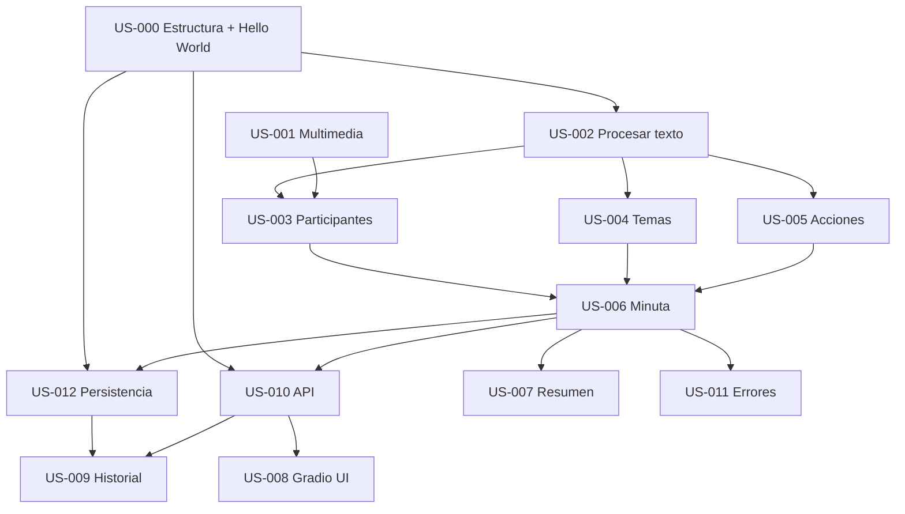

# Backlog Priorizado — MeetMind

> Basado en PRD v1.0 y User Stories | Proyecto MeetMind

---

## Tabla de Priorización

| User Story | Impacto Usuario/Negocio | Urgencia | Complejidad | Riesgos/Dependencias | Prioridad |
|------------|-------------------------|----------|-------------|----------------------|-----------|
| US-000 | Alto | Alta | Media | Base de todo el proyecto | **P0** |
| US-003 | Alto | Alta | Media | Base del workflow | **P1** |
| US-004 | Alto | Alta | Media | Base del workflow | **P1** |
| US-005 | Alto | Alta | Media | Base del workflow | **P1** |
| US-006 | Alto | Alta | Media | Depende US-003, 004, 005 | **P1** |
| US-007 | Alto | Alta | Baja | Depende US-006 | **P1** |
| US-002 | Alto | Alta | Baja | Nodo preprocess; habilita demo rápida | **P1** |
| US-012 | Alto | Alta | Media | Requerido para historial | **P1** |
| US-001 | Alto | Media | Alta | Requiere STT; bloquea multimedia | **P2** |
| US-010 | Alto | Media | Media | Habilita integración; depende workflow | **P2** |
| US-008 | Alto | Media | Media | Depende API; UX principal | **P2** |
| US-009 | Medio | Media | Baja | Depende US-012, API | **P2** |
| US-011 | Medio | Media | Media | Mejora robustez; depende workflow completo | **P2** |

---

## Criterios de Priorización Aplicados

1. **Impacto:** Valor para usuario final y viabilidad del producto
2. **Urgencia:** Necesidad para un MVP funcional y demo
3. **Complejidad:** Esfuerzo estimado de implementación
4. **Riesgos/Dependencias:** Orden lógico por dependencias técnicas

---

## Orden Sugerido de Implementación (MVP)

### Fase 0: Estructura Inicial (P0)

0. **US-000** — Estructura del proyecto + Hello World end-to-end (API, Grafo mínimo, Gradio, COMO-EJECUTAR.md)

### Fase 1: Workflow Core (P1)

1. **US-012** — Persistencia (permite guardar resultados)
2. **US-002** — Procesamiento de texto (entrada más simple, sin STT)
3. **US-003** — Extracción de participantes
4. **US-004** — Identificación de temas
5. **US-005** — Extracción de acciones
6. **US-006** — Generación de minuta
7. **US-007** — Resumen ejecutivo

### Fase 2: API e Integración (P2)

8. **US-010** — API REST
9. **US-001** — Procesamiento multimedia (transcripción)
10. **US-008** — Interfaz Gradio
11. **US-009** — Historial en UI
12. **US-011** — Manejo de errores y casos edge

---

## Dependencias entre User Stories

---

## Resumen por Prioridad

| Prioridad | User Stories | Enfoque |
|-----------|--------------|---------|
| **P0** | 1 | Estructura inicial, Hello World E2E, instrucciones de ejecución |
| **P1** | 7 | Workflow completo con texto + persistencia; valor core |
| **P2** | 5 | API, multimedia, UI, historial, robustez |
